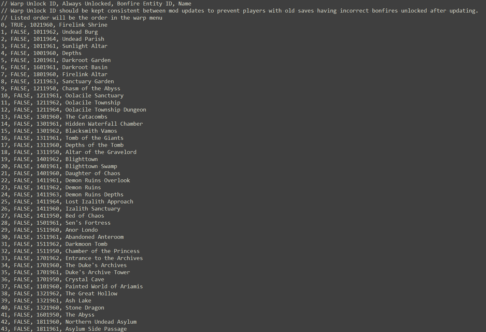

# Dark Souls 1 Bonfire Warp Reconfiguration Tool

This program directly modifies game files to let you customize which bonfires are warpable and other details through a single .txt file. The vanilla warp system is almost entirely replaced, and functions nearly identically.

This is meant to be a modders resource and (hopefully) compatible with practically any assortment of non-vanilla game files.

Compatible with Dark Souls PTDE and Dark Souls Remastered.

# Underlying differences vs vanilla
- Everything handling bonfire warping and which bonfires are warpable is exposed in bonfire talkESD and common EMEVD.
- A different (customizable) range of flags are used to remember unlocked bonfires warps, instead of hardcoded flags.
- Warp menu is no longer capable of displaying "No bonfires available for warping" message. This never appeared during normal gameplay since in vanilla Firelink Shrine Warp is automatically unlocked upon m10_02 map load.
- The trigger for warping during the warp-in animation (7725) is timed by amount of frames rather than TAE event message 40, and occurs a couple frames earlier.
- Event FMG is used for bonfire names in the warp menu instead of location FMG.
- Warp menu no longer shows "Warp to selected bonfire" "OK / Cancel" confirmation prompt.

# Instructions
- Download and install .NET 9.0 Desktop Runtime (https://dotnet.microsoft.com/en-us/download/dotnet/9.0)
- If using Prepare to Die Edition and your game files have never been unpacked: run UXM Selective Unpacker (https://github.com/Nordgaren/UXM-Selective-Unpack) or UDSFM (https://www.nexusmods.com/darksouls/mods/1304)
- Extract the program files anywhere you want.
- Run the program.
- Click "Edit BonfireWarps.txt" to open the editable list of warpable bonfires (this file can be found at "Resources\BonfireWarps.txt").
	- Add, remove, and otherwise modify warpable bonfires as desired. 
	- You can use // to comment out lines to easily disable warps.
	- Once finished, save the .txt file.
- Click browse, go to your Dark Souls 1 installation folder, and select DARKSOULS.exe or DarkSoulsRemastered.exe
- Click install and wait for it to finish.
- After successful installation, a Log file will be generated detailing new bonfire warp info and game file backups will be stored in the program's "Backup" folder.
- ### *If relevant, update meta/unpacked files used by other tools (such as DarkScript 3 .js files), otherwise changes made by this program may be lost when you modify those files later.* See below for affected game systems.

# Game systems modified by this program
- EMEVD (common.emevd): New events that check for bonfire warp request flags (set from talkESD), and initiates a bonfire warp.
- Event flags: Several hundred new flags are utilized, and the flag range used can be changed in "Resources\EventFlags.txt".
	- Bonfire warp unlocked flags.
		- Set when the player rests at a bonfire.
		- Warp that are set to be always unlocked do not have their warp unlocked flag checked by anything.
	- Bonfire warp requested flags.
		- Set when a selection is made in the talkESD warp menu for EMEVD to detect and initiate a warp.
	- EMEVD common event IDs.
- FMG (Event_Patch): Names for all warpable bonfires. This uses a different FMG than vanilla warp names.
	- FMG Entry ID range can be changed in "Resources\EventTextIds.txt".
- MSB: "Player" warp targets to all bonfires that don't have one.
	- Many vanilla bonfires do not have "Player" warp targets, so the program ensures every bonfire has one. Position & rotation are taken from the bonfire's SpawnPoint.
- TalkESD: All bonfire talk IDs.
	- Warp menu command is replaced with the new warp system menu.
	- Set a new "Bonfire Warp Unlocked" flag when a bonfire is rested at.
	- Specific state IDs (unused in vanilla) must not have been already added by other mods. In the incredibly unlikely situation this happened, you can change the state IDs in "Resources\data\TalkEsdTargetStates.txt".
		- If you change the state IDs in that file _after_ already running the program with different state IDs, the program will be unable to update warps properly. Bonfire talkESD will need to be manually changed to have the new states IDs.
	- In situations where you want to manually modify bonfire talkESDs after this program is run:
		- This mod adds a SetEventFlag() command immediately before RequestSave(). Make sure it remains immediately before RequestSave().
		- Maintain the state IDs for states created by this program (they can be seen in "Resources\data\TalkEsdTargetStates.txt")

Uses https://github.com/JKAnderson/SoulsFormats